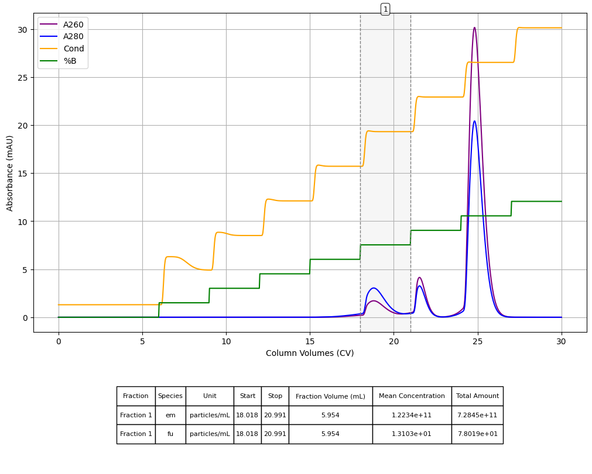

# openiex

**Ion‐Exchange Chromatography Simulator**

**openiex** is a lightweight Python library for simulating ion-exchange separations (step gradients, continuous gradients, breakthrough curves) using steric mass-action (SMA) kinetics.  It’s ideal for rapid prototyping of method development, parameter fitting, and exploring “what-if” scenarios without tying up a real column.

---



## Who Should Use This

- Academic researchers  
- Biotech startups & PD scientists  
- Core labs and CROs  

---

## Features

- Define arbitrary buffer compositions, column dimensions, and flow programs  
- Model ions, proteins (or other macromolecules), and inert species  
- SMA isotherm with cooperativity, steric hindrance, and kinetic rates  
- Step‐gradient, linear‐gradient, and breakthrough‐curve simulations  
- Fast, robust ODE solver interface with adjustable tolerances  
- Plotting utilities: full chromatograms, per-species traces, internal column snapshots  
- Fraction analysis: calculate yield & purity over any elution window  
- Easy save/load of simulation results for later review

---

## Installation

```bash
# Clone the repo and install in editable mode:
git clone https://github.com/you/openiex.git
cd openiex
pip install -e .
```

## Documentation

- **Mathematical Derivations**: see the [math notebook](notebooks/math_background.ipynb) for all the SMA derivations and dimensional analysis  
- **Example Workflows** in the [`notebooks/`](notebooks/) directory  