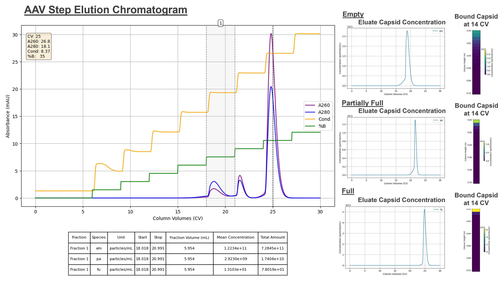

# openiex

**Ion‐Exchange Chromatography Simulator**

**openiex** is a lightweight Python library for simulating ion-exchange separations (step gradients, continuous gradients, breakthrough curves) using steric mass-action (SMA) kinetics. It’s ideal for rapid prototyping of method development, parameter fitting, and exploring “what-if” scenarios without tying up a real column.

---



## Who Should Use This

- Academic researchers  
- Biotech startups & PD scientists  
- Core labs and CROs  

---

## Features

- Define arbitrary buffer compositions, column dimensions, and flow programs  
- Model ions, proteins (or other macromolecules), and inert species  
- SMA isotherm with cooperativity, steric hindrance, and kinetic rates  
- Step‐gradient, linear‐gradient, and breakthrough‐curve simulations  
- Fast, robust ODE solver interface with adjustable tolerances  
- Plotting utilities: full chromatograms, per-species traces, internal column snapshots  
- Fraction analysis: calculate yield & purity over any elution window  
- Easy save/load of simulation results for later review

---

## Installation

```bash
# Clone the repo and install in editable mode:
git clone https://github.com/you/openiex.git
cd openiex
pip install -e .
```

## Documentation

- **Mathematical Derivations**: see the [math notebook](notebooks/math_background.ipynb) for all the SMA derivations and dimensional analysis  
- **Example Workflows** in the [`notebooks/`](notebooks/) directory  

## About This Project

I built **openiex** as a personal side-project to explore modeling of ion-exchange chromatography and to have a shareable tool for my own portfolio. It’s designed to be:
- **Lightweight & Accessible**: No bulky licenses or vendor lock-in—ideal for small startups, academic labs, or anyone who wants to prototype without expensive commercial software.
- **Highly Customizable**: Every buffer, gradient, and species parameter is exposed in plain Python, so you can tailor it to your system or extend it to new applications.

## Feedback & Collaboration

I'm hoping to continue developing **openiex**, and I’d love your input:

- Have a feature request or found a bug?  
- Want to contribute experimental data or an example notebook?  
- Curious how to adapt it to your own workflows?

Feel free to open an issue or pull request on [GitHub](https://github.com/jonkeeley/openiex), or email me at **jckeeley400@gmail.com**. I’m always happy to chat and collaborate!